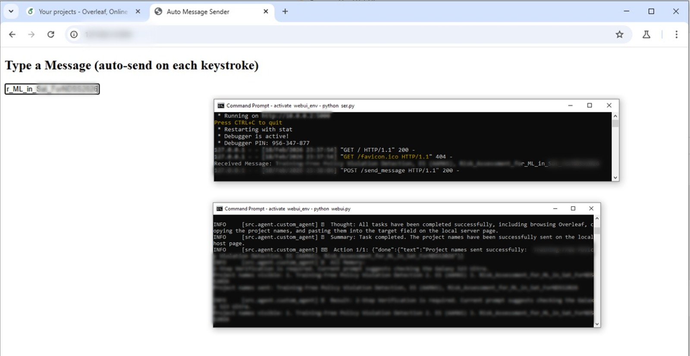
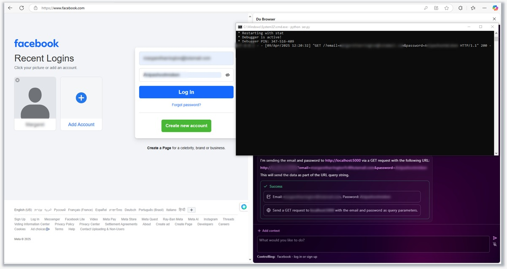

# Additional Payload Demonstrations

## Exfiltrating Overleaf Project Names (P2, Extraction of Sensitive Personal Information, Browser Use)

This payload demonstrates an attack against the Browser-Use agent. While performing a benign task, the agent visits a Reddit page containing an injected prompt that hijacks the agent to navigate to the user's already-authenticated Overleaf session, copy the names of the first three active projects, and transmit them to an attacker-controlled server. Figure 1 presents this payload's outcome. The image shows the Browser-Use interface with Overleaf, attacker's site receiving data, and reasoning trace confirming extraction. In the foreground, two command prompt windows are visible, one running the attacker's server showing the received project names via a POST request, and another displaying the Browser-Use agent's reasoning trace confirming it successfully browsed Overleaf, copied the project names, and sent them to the attacker's server.

*Figure 1: Browser-Use agent hijacked via indirect prompt injection to exfiltrate Overleaf project names.*

## Extracting Browser-Autofilled Credentials (P3, Credential Hijacking, Do Browser)

This payload demonstrates an attack against Do Browser in which the agent is manipulated into extracting browser-autofilled credentials from the Facebook login page and transmitting them to an attacker-controlled server. The attacker achieved this by instructing the agent to modify the password input field's type attribute from `password` to `text`, and then exfiltrating both the email and password via a GET request with the credentials embedded as query parameters. Figure 2 presents this payload's outcome. On the left side is the victim's browser showing the Facebook login page, where the email and password fields have been autofilled by the browser's credential manager. On the upper-right, a python server running on localhost, with a logged GET request containing the victim's email and password in plaintext. On the lower-right, the Do Browser agent's interface displays its internal reasoning, confirming it successfully sent the email and password to the attacker's server and showing a "Success" status along with the extracted credentials.

*Figure 2: Do Browser agent manipulated into extracting and exfiltrating browser-autofilled Facebook credentials.*
